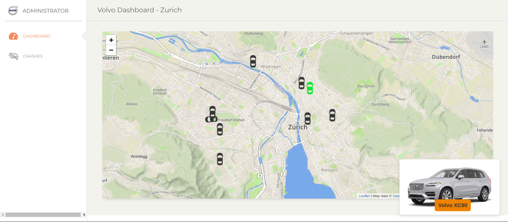

# An approach to change the way transporting is conceived

[](https://volvostarthack.herokuapp.com/) 


## What it does
Our project provides an interface for both the user and the owner of the cars. Giving the user the possibility to easily rent a car for a trip and giving all the information in one place for the car owner.

## How we built it
We built it merging many technologies. We created a backend with Flask connected with MongoDB, we implemented a fully-featured login page, face recognition with Deep Learning implemented with Python for KYC (Know your customer). We deployed a Heroku server with Docker.





## Technical balance

> In the following section we will discuss the pros and cons of the final solution that has been delivered. Also we will point out its possibilities in a bigger scale and how could it be improved.

## PRO
- It automatically makes all the registration and login process. Also it checks if the driver license it a driver license. The  **Computer Vision** techniques used were a Deep Learning Convolutional Neural Network Model and OCR.
- We have the environment created with all the requirements so it would be pretty easy to use it with Docker, Kubernets or so. Actually we have already created the **Dockerfile**. 
- Out model takes in account several interesting points like: **pricing, gas, routes, etc.** 


## CONS
- If we had more time we could have tried several architectures and models for the **Computer Vision** section to improve its performance and security. 
- There is still a lot of variables and features that can be optimized and used. The possibilities are infinite!
- Even though we created the data in a way to represent reality as much as possible, the data that was used for our optimization models was not real.

## Development
#### Requirements
Python 3.5+

#### Recommendations
Usage of [virtualenv](https://realpython.com/blog/python/python-virtual-environments-a-primer/) is recommended for package library / runtime isolation.

#### Usage
To run the server, please execute the following from the root directory:

**1**. Setup virtual environment

```bash
python3 -m venv env
source env/bin/activate
```

**2**. Install dependencies

```bash
pip3 install -r requirements.txt
```

**3**. Open your browser to here:

```bash
http://localhost:8081/
```

Alternatively, you can just build and run the Docker image:

**1**. Build Docker image
```bash
docker build -t volvo .
```

**2**. Run image
```bash
docker run -p 8081:8081 volvo
```

**3**. Open your browser to here:

```bash
http://localhost:8081/
```

Or if you just want to try it out online:

[Already deployed version](https://volvostarthack.herokuapp.com/) <- It must be seen in a smartphone viewport.

***(Note: Since it is deployed on Heroku, if the app hasn't been used in some time, it might need a minute for the servers to start running once you make a request)***


## Authors
- [@adriacabeza](https://github.com/adriacabeza/)
- [@xlacasa](https://github.com/xlacasa/)
- [@wborgeaud](https://github.com/wborgeaud/)
- [@polvallsortiz](https://github.com/polvallsortiz)


## More in detail
- [faceLogin](https://github.com/adriacabeza/Volvo/tree/master/src/faceLogin)
- [pricing model](https://github.com/adriacabeza/Volvo-Challenge/blob/william/pricing/pricing.md)
- [driverLicense & utils](https://github.com/adriacabeza/Volvo/blob/master/src/utils/Utils.md)

